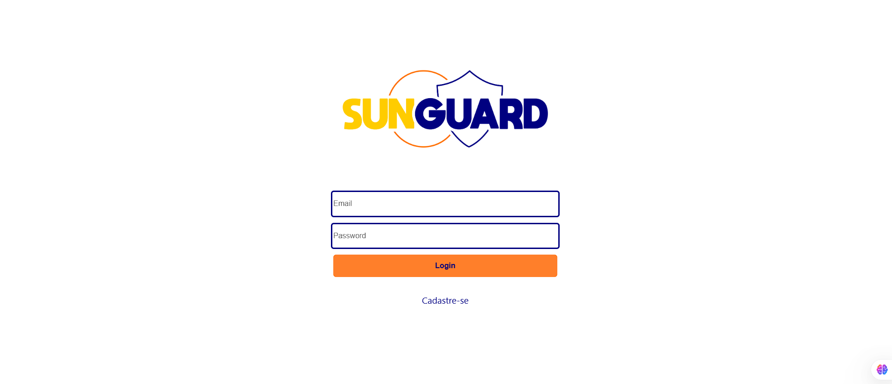
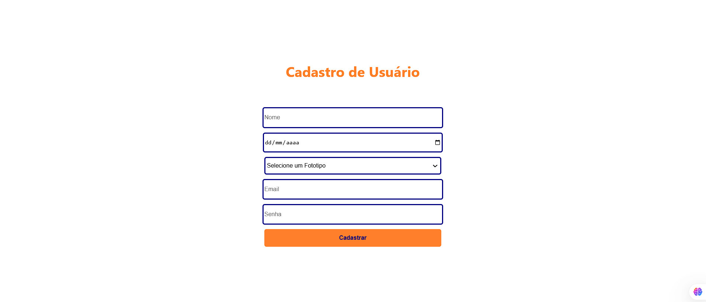
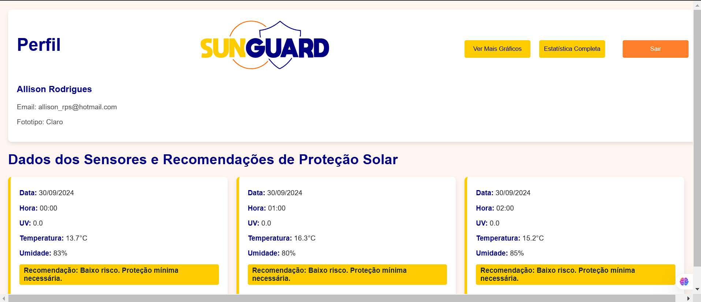
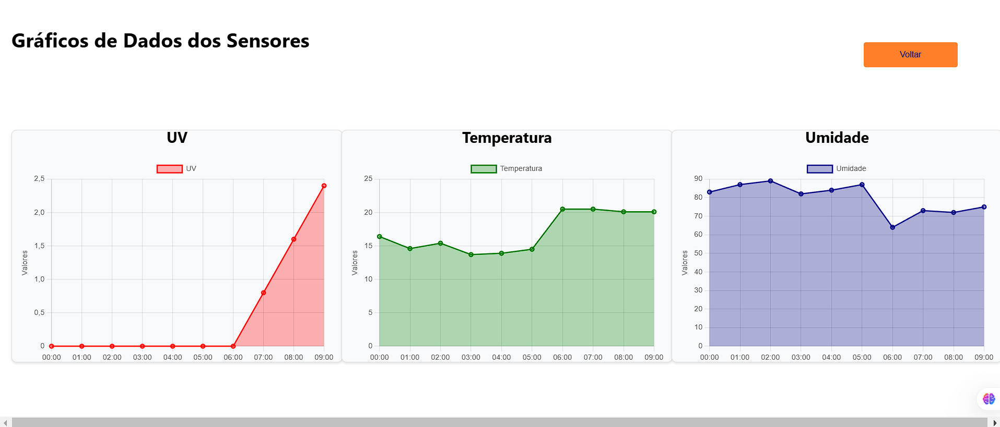
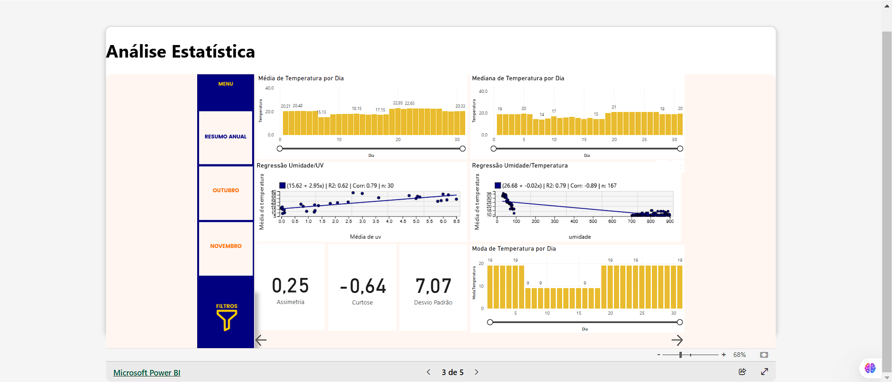
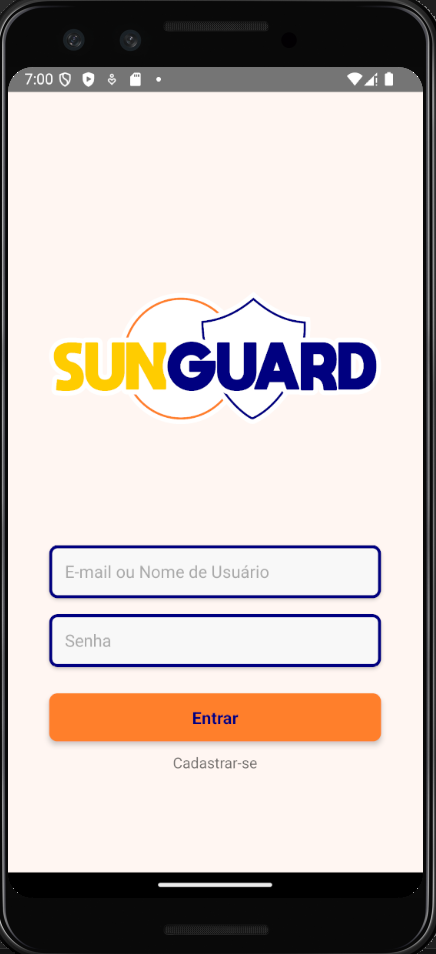
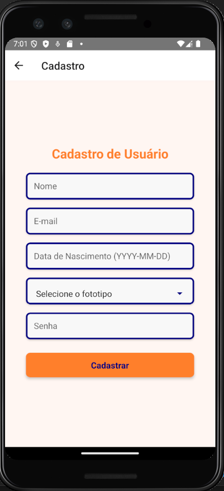
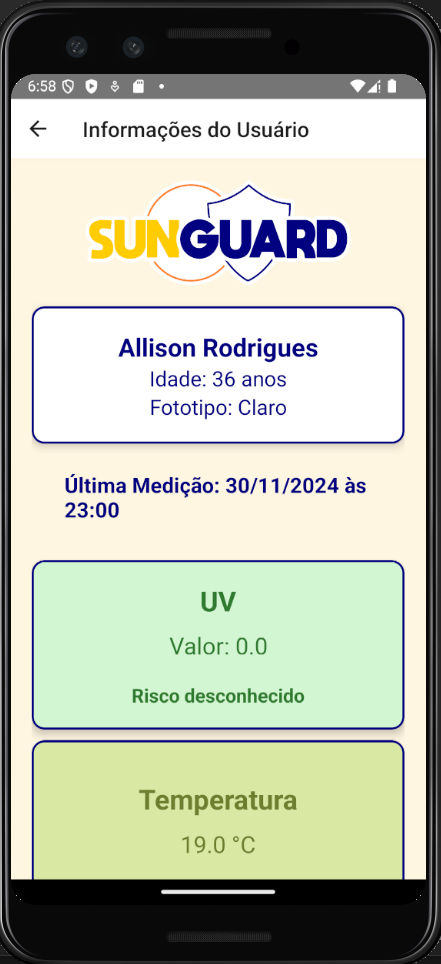
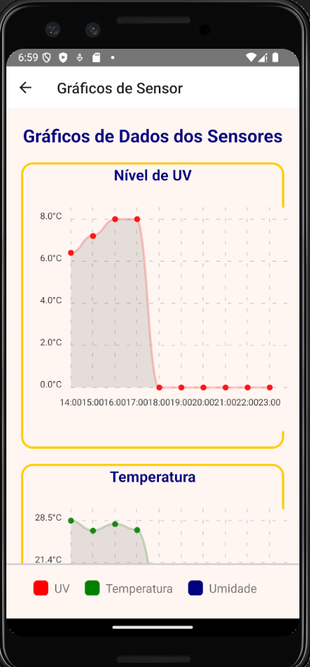

  

  <a href="https://sun-guard.vercel.app">SUNGUARD WEB</a>

# PROJETO PI 4º DSM - FATEC FRANCA - 2024-2

---

## Grupo
-  - **Allison Rodrigues de Paula e Silva**    
-  - **Bruno Santos Silva**
-  - **Paula Cristina Abib Teixeira**
-  - **Samir Lopes Rosa**

---

## Descrição do Projeto
Através da aplicação web e mobile será possível coletar dados de incidência de raios UV, temperatura e umidade, criando **alertas** sobre o risco de exposição ao Sol de acordo com o tom de pele (fototipo) do usuário.

## Funcionalidades:
- Coleta de dados de incidência de raios UV, temperatura e umidade.
- Cadastro e autenticação de usuários.
- Notificações de alerta de exposição ao Sol.
- Dashboards com gráficos de dados.

---

## Tecnologias Utilizadas

### IoT
- **Dispositivo:** Arduino Uno
- **Sensores:**
  - GUVA S12D (Raios UV)
  - DHT11 (Temperatura e Umidade)

### Backend
-    

### Rotas API:
- [https://sunguard-backend.vercel.app/usuarios](https://sunguard-backend.vercel.app/usuarios)
- [https://sunguard-backend.vercel.app/sensors](https://sunguard-backend.vercel.app/sensors)
- [**Documentação da API Swagger**](https://app.swaggerhub.com/apis/ALLISONRPS/SunGuard_API/1.0.0#/) 

### Frontend Web
-    

### Mobile
-   

### Análise de Dados
-  

---

## Análise Estatística

--- 

## Portifólio UX-UI

---

## PRINTS WEB

---

## PRINTS MOBILE

  
  
  
  

