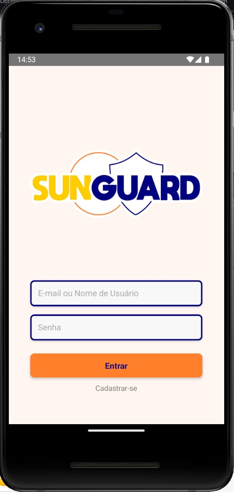
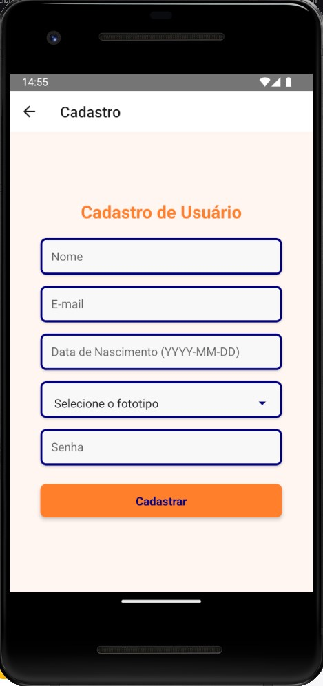
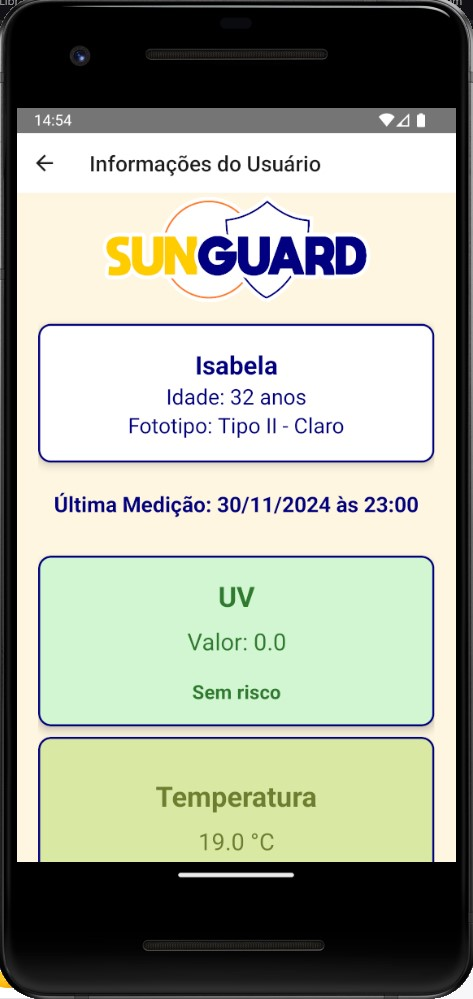
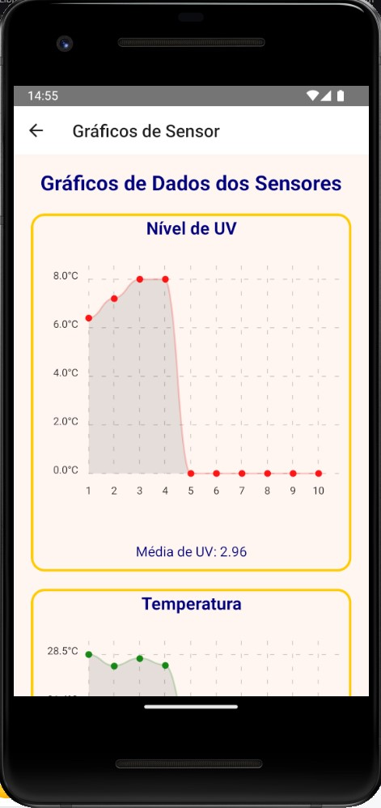
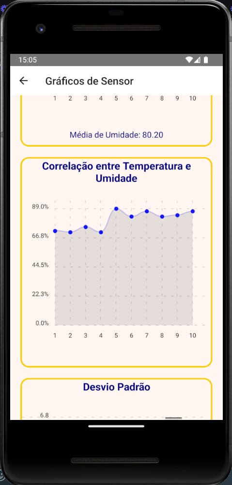
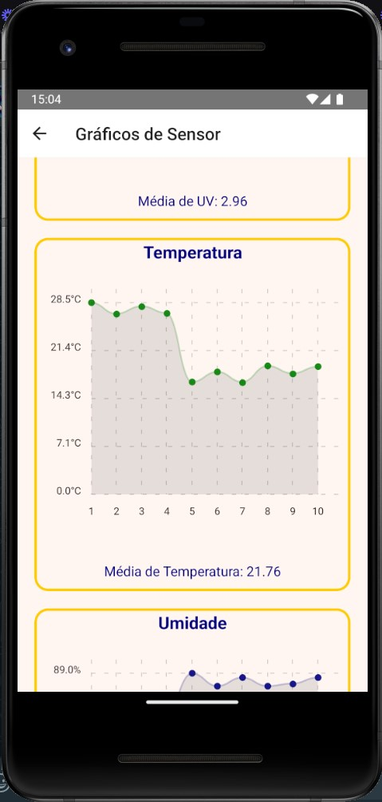
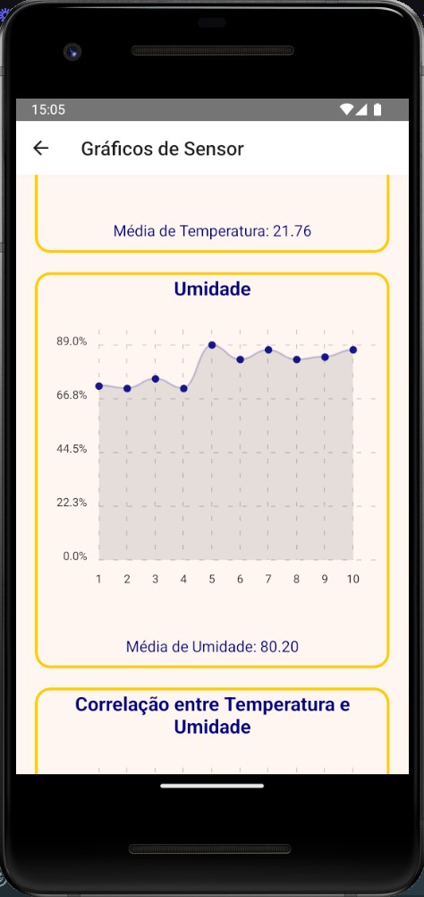
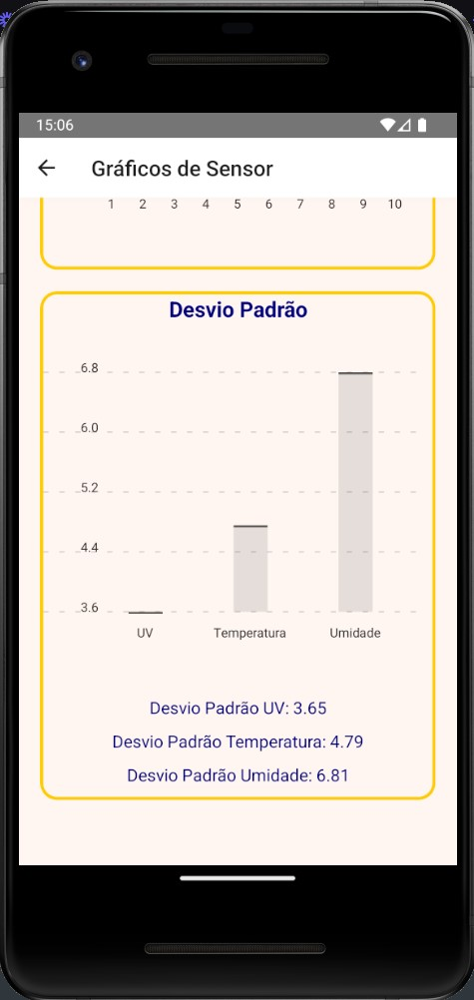

<p align="center">
  
</p>

<p align="center">
# PROJETO PI 4º DSM - FATEC FRANCA - 2024-2
</p>

---

**SunGuard Mobile** 
é a aplicação mobile do projeto SunGuard, desenvolvida em React Native, que fornece monitoramento de dados UV, temperatura e umidade. 

A aplicação permite cadastro de usuários, visualização de gráficos e informações personalizadas com base no fototipo do usuário.

---

<p align="center">
  
  
  
  
  
  
  
  
</p>

---

## **Pré-requisitos**

Antes de começar, você precisará ter instalado:

- [Node.js](https://nodejs.org/) (versão 16 ou superior)
- [Yarn](https://classic.yarnpkg.com/lang/en/docs/install/) ou NPM
- [Android Studio](https://developer.android.com/studio) (com um Virtual Device configurado)

---

## **COMO EXECUTAR O PROJETO: **

1. **Clone este repositório**:
   ```bash
   git clone https://github.com/allisonrps/4-DSM-PI-sun-guard.git

2. **Acesse a pasta /mobile**:
   ```bash
   cd mobile

3. **Instale as depêndencias**:
   ```bash
   npm install
   yarn install

4. **Configure um emulador Android:**:
Certifique-se de que você tenha um Virtual Device configurado no ANDROID STUDIO 
e que o emulador esteja rodando ANTES de iniciar o projeto.

5. **Inicie o App:**:
   ```bash
   npx react-native run-android

---
