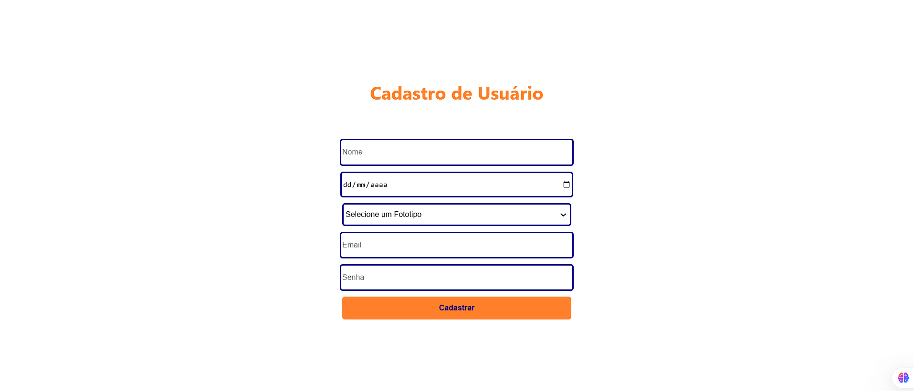
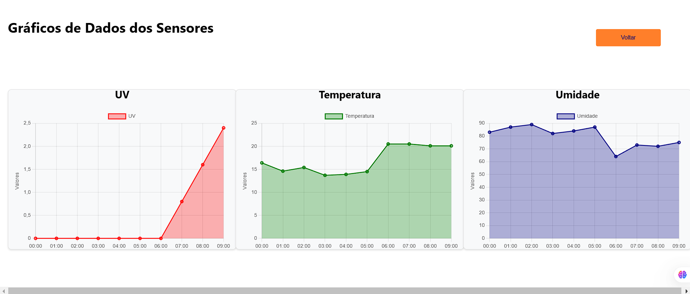

<p align="center">
  
</p>

<p align="center">
  <a href="https://sun-guard.vercel.app">SUNGUARD WEB</a>
</p>

---

**SunGuard Web** 
é a aplicação mobile do projeto SunGuard, desenvolvida em React, que fornece monitoramento de dados UV, temperatura e umidade. 

A aplicação permite cadastro de usuários, visualização de gráficos, análise completa em Power BI e informações personalizadas com base no fototipo do usuário.

---







---

## **Pré-requisitos**

Antes de começar, você precisará ter instalado:

- [Node.js](https://nodejs.org/) (versão 16 ou superior)
- [Yarn](https://classic.yarnpkg.com/lang/en/docs/install/) ou npm

---

## **COMO EXECUTAR O PROJETO: **

1. **Clone este repositório**:
   ```bash
   git clone https://github.com/allisonrps/4-DSM-PI-sun-guard.git

2. **Acesse a pasta /web**:
   ```bash
   cd web

3. **Instale as depêndencias**:
   ```bash
   npm install
   yarn install

4. **Inicie o Projeto:**:
   ```bash
   npm start

5. **Acessar localmente:**:
   https://localhost:3000

---


